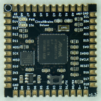
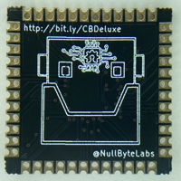

# CircuitBrains

## Deluxe
 
https://www.kevinneubauer.com/portfolio/circuitbrains-deluxe/

Small form-factor 48-pin castellated pad module. Designed to allow an easy implementation of CircuitPython in maker/hacker projects without the bulk of a large breakout board.

Specs:
- Atmel ATSAMD51J19A Microcontroller (32-bit ARM Cortex M4)
- 8 MB SPI Flash
- Onboard 3.3V LDO Regulator
- Power and Status LEDs
- Breakouts for SPI and I2C
- Breakouts for 13 Analog and 19 Digital Inputs/Outputs

Revision History / Known Issues:

v1.0:
- Initial release
- Analog output does no work due to silicon issue with ATSAMD51. Requires a dedicated VREF/AREF pin with external 3.3 VREF input

v1.1 & v1.2:
- Not released due to issues resulting from design changes. I removed the pull-up on RST because the datasheet says it was optional. Turns out it was not so optional. These revisions will not function without a 10K resistor bodged onto the RST line.
- Dedicated a pin to VREF. Added a 0 Ohm resistor with a 3.3v input into VREF. 
- Switched from 4 layer to 2 layer board layout
- Rearranged layout to allow for pad documentation
- Added silkscreen for pad/pin assignments
- Added logo
- Removed inductor on VSW. Board will only work on linear power mode due to this.
- Removed polyfuse. Acceptable risk tradeoff for the space. If you want a fuse, add it to your design that incorporates this board.
- Removed Schottkey diode on VIN. Acceptable risk tradeoff for the space.
- Changed to a different flash chip with a smaller footprint
- Shuffled I/O pin assignments for more efficient trace routing/layout

v1.3:
- Added 10k pull-up back to RST.
- All tests working out: I2C, SPI, Analog & Digital In, Analog Out

## Basic
 
https://www.kevinneubauer.com/portfolio/circuitbrains-basic/

Small form-factor 28-pin castellated pad module. Designed to allow an easy implementation of CircuitPython in maker/hacker projects without the bulk of a large breakout board.

Specs:
- Atmel ATSAMD21E18A Microcontroller (32-bit ARM Cortex M0)
- 4 MB SPI Flash
- Onboard 3.3V LDO Regulator
- Power and Status LEDs
- Breakouts for SPI and I2C
- Breakouts for 4 Analog and 8 Digital Inputs/Outputs

Revision History / Known Issues:
v1.2:
- Initial Release
- All tests working out